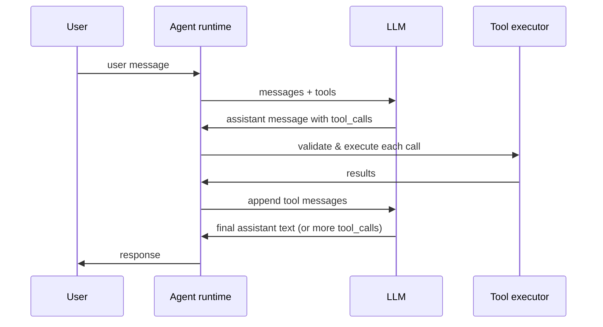

LLM không có tool chỉ có thể sắp xếp lại token đã thấy lúc training. **Function calling** (hay **tool use**) là cầu nối chuẩn để model *yêu cầu* hành động — query DB, gọi API, chạy code — trong khi runtime của bạn giữ toàn quyền thực thi.

Bài này là tầng implementation giữa [prompt design](/blog/prompt-engineering-for-agents/) và [agent patterns](/blog/agent-design-patterns-react-reflection-planning/). Bạn sẽ học cách define tool, chạy loop ổn định, xử lý lỗi, và tránh biến agent thành open proxy cho code tùy ý.

> Mô hình tư duy:Function calling là model **điền vào phiếu yêu cầu**, không phải bấm nút. Model viết "tôi muốn gọi `get_weather` với `city=Hanoi`"; runtime của bạn là nhân viên kiểm phiếu, quyết định có làm không, chạy hành động, và trả kết quả. Model không bao giờ chạm hệ thống của bạn trực tiếp — nó chỉ đề xuất.

<iframe
  src="/tools/function-calling-demo/"
  title="Function calling and tool use interactive demo"
  loading="lazy"
  style="width:100%;height:720px;border:1px solid var(--color-border);border-radius:8px;background:#0a0a0a;"
></iframe>

Mở demo đầy đủ:

---

## Vì sao cần tool: model đề xuất, runtime quyết định

LLM là **bộ dự đoán text stateless**. Chúng không có quyền truy cập trực tiếp CRM, weather API, hay production DB trừ khi bạn nối vào.

| Without tools | With tools |
|---------------|------------|
| Model hallucinates facts | Model requests verified data |
| No side effects | Controlled side effects via your code |
| Single-turn Q&A | Multi-step agent loops |
| Static knowledge cutoff | Live systems of record |

> Hợp đồng cốt lõi: Model output **tool call có cấu trúc** (tên + argument). Server **validate, execute, trả kết quả**. Model không bao giờ chạy code trực tiếp.

Provider (OpenAI, Anthropic, Google, open-weight stack) expose qua chat API với parameter `tools` và message kết quả tool. Mental model giống nhau giữa vendor dù tên field hơi khác.

---

## Define tool bằng JSON Schema

Tool được mô tả cho model bằng **JSON Schema** gắn với mỗi function definition. Schema cho model biết *gì* có thể gọi và *argument* nào hợp lệ.

```json
{
  "type": "function",
  "function": {
    "name": "get_weather",
    "description": "Get current weather for a city. Returns temperature and conditions.",
    "parameters": {
      "type": "object",
      "properties": {
        "city": {
          "type": "string",
          "description": "City name, e.g. Hanoi, San Francisco"
        },
        "units": {
          "type": "string",
          "enum": ["celsius", "fahrenheit"],
          "description": "Temperature unit"
        }
      },
      "required": ["city"]
    }
  }
}
```

### Tên và description quan trọng hơn bạn nghĩ

Model chọn tool **chỉ từ text** — tên, description, và mô tả parameter. Tool mơ hồ gây gọi sai; tool trùng chức năng gây nhầm lẫn.

| Anti-pattern | Fix |
|--------------|-----|
| `search` | `search_customer_orders` — scope is explicit |
| Description: "Gets data" | "Fetch order by ID from the orders service. Read-only." |
| One mega-tool with 20 params | Split into focused tools with small schemas |
| Parameter `id` with no type | `"type": "string", "pattern": "^ord_[a-z0-9]+$"` |

> Tip senior: Viết description tool như onboard junior chưa từng thấy codebase. Gồm **khi nào dùng**, **khi nào không**, và **side effect** (read vs write).

Giữ catalog tool **nhỏ mỗi request**. Theo [context engineering](/blog/context-engineering-and-agent-memory/), mỗi tool definition tốn token trong stable prefix. Dynamic tool selection — chỉ load tool liên quan intent hiện tại — giảm cost và gọi nhầm.

---

## Vòng agent: request → tool_call → execute → tool_result → answer

The canonical loop looks like this:



Từng bước:

1. **Build context** — system prompt, history, user message, tool definitions.
2. **Model turn** — LLM trả text thuần hoặc `tool_calls` với `name`, `arguments`, và `tool_call_id`.
3. **Execute** — runtime parse argument, validate schema, chạy handler, capture result hoặc lỗi.
4. **Append tool messages** — một message mỗi call, liên kết bằng `tool_call_id`.
5. **Model turn lại** — tổng hợp câu trả lời cuối hoặc emit thêm tool call.
6. **Lặp** đến khi model ngừng gọi tool hoặc chạm step limit.

Sketch implementation tham chiếu:

```python
async def agent_loop(messages: list, tools: list, max_steps: int = 8):
    for step in range(max_steps):
        response = await llm.chat(messages=messages, tools=tools)

        if not response.tool_calls:
            return response.content  # final answer

        # Append assistant message WITH tool_calls intact
        messages.append(response.assistant_message)

        for call in response.tool_calls:
            try:
                args = json.loads(call.arguments)
                validate_args(call.name, args, tools)
                result = await execute_tool(call.name, args)
            except ToolError as e:
                result = {"error": str(e)}

            messages.append({
                "role": "tool",
                "tool_call_id": call.id,
                "content": json.dumps(result),
            })

    raise MaxStepsExceeded("Agent did not finish within step budget")
```

> Đừng strip `tool_calls` khỏi history. Model cần lượt assistant *đã yêu cầu* tool để hiểu kết quả tool sau đó.

Dùng demo trên để xem mảng `messages` tăng qua từng phase.

---

## Gọi tool song song

API hiện đại cho model emit **nhiều `tool_calls` trong một lượt assistant**. Ví dụ: "Thời tiết Hanoi và 23 × 19?" → `get_weather` + `calculator` song song.

| Benefit | Caveat |
|---------|--------|
| Lower latency — independent I/O runs concurrently | Results may arrive out of order; link by `tool_call_id` |
| Fewer round-trips to the LLM | Do not assume call order implies dependency |
| Better UX for multi-fact questions | Writes with dependencies must stay sequential |

```json
{
  "role": "assistant",
  "content": null,
  "tool_calls": [
    {
      "id": "call_weather_001",
      "type": "function",
      "function": {
        "name": "get_weather",
        "arguments": "{\"city\":\"Hanoi\"}"
      }
    },
    {
      "id": "call_calc_002",
      "type": "function",
      "function": {
        "name": "calculator",
        "arguments": "{\"expression\":\"23 * 19\"}"
      }
    }
  ]
}
```

Execute call độc lập bằng `asyncio.gather` hoặc worker pool; append **một tool message mỗi call** trước lượt model tiếp theo.

> Khi nào tắt parallel: Workflow tuần tự (`create_draft` → `send_email`), transaction, hoặc tool mà call B phụ thuộc output call A. Dùng policy prompt hoặc `parallel_tool_calls: false` nếu API hỗ trợ.

---

## Ép và giới hạn lựa chọn tool

Không phải lượt nào cũng nên cho phép mọi tool.

| Mode | API pattern | Use case |
|------|-------------|----------|
| Auto | `tool_choice: "auto"` | General agent — model decides |
| Required | `tool_choice: "required"` | Must call a tool (structured extraction) |
| Forced function | `tool_choice: {"type":"function","function":{"name":"X"}}` | Pipeline step that always runs X |
| None | `tools: []` or omit tools | Pure chat, no side effects |

Ví dụ **forced tool** — luôn qua classifier trước action tool:

```json
{
  "tool_choice": {
    "type": "function",
    "function": { "name": "classify_intent" }
  }
}
```

Giới hạn tool giảm **attack surface** và **token cost**. Agent billing không nên thấy `delete_all_users` cùng request với `get_invoice`.

---

## Validate argument và xử lý lỗi

Không bao giờ tin argument do model sinh.

1. **JSON parse** — string `arguments` lỗi format rất hay gặp.
2. **Schema validation** — dùng JSON Schema, Zod, Pydantic, hoặc Ajv.
3. **Business rule** — user chỉ truy cập `order_id` của mình.
4. **Sanitization** — reject shell metacharacter, path traversal, SQL fragment trong string field.

Khi validate hoặc execute fail, **trả lỗi cho model** trong tool content — đừng nuốt lỗi. Model thường tự sửa ở lượt tiếp theo.

```json
{
  "role": "tool",
  "tool_call_id": "call_calc_005",
  "content": "{\"error\":\"Division by zero is undefined\",\"expression\":\"999 / 0\"}"
}
```

| Error type | Return to model | Retry? |
|------------|-----------------|--------|
| Invalid JSON args | Parse error + expected schema | Model fixes args |
| Schema violation | Field-level detail | Model fixes args |
| Transient HTTP 503 | Error + suggest retry | Runtime retries with backoff |
| Auth / permission denied | Clear denial, no retry | Escalate to user |
| Unknown tool name | Should not happen if catalog is consistent | Log bug |

> Anti-pattern: Catch mọi lỗi và trả `"Something went wrong"` — model không thể recover. Cụ thể và actionable.

---

## Structured output vs tool call

**Structured output** (JSON mode, `response_format`, grammar constraint) ép *message assistant cuối* vào schema. **Tool call** cho model *yêu cầu side effect* giữa reasoning. Giải quyết bài toán khác nhau; agent production thường dùng **cả hai**.

| | Tool calls | Structured output |
|---|------------|-------------------|
| Purpose | Actions + retrieval | Final typed response |
| Timing | Mid-loop | Usually last turn |
| Side effects | Yes (your executors) | No |
| Example | `search_docs(query)` | `{ "summary": "...", "confidence": 0.92 }` |

Pattern: tool thu thập fact → structured output format payload gửi user.

---

## Bảo mật: confused deputy và prompt injection

Tool use là chỗ agent trở nên **nguy hiểm**. Model là planner không tin cậy; user và content retrieve có thể inject instruction.

Không bao giờ execute argument không tin cậy một cách mù quáng:

- Không `eval()`, `exec()`, hoặc shell interpolation trên string model cung cấp.
- Chỉ query parameterized — không nối SQL.
- Allow-list path cho file tool — reject `../../etc/passwd`.
- Tách tool **read** và **write**; yêu cầu confirm hoặc auth cao hơn cho op phá hoại.

Bài toán **confused deputy**: agent có credential; user lừa nó dùng credential cho mục tiêu attacker. Biện pháp:

| Layer | Control |
|-------|---------|
| Identity | Bind tool calls to authenticated user; enforce row-level scope |
| Allow-list | Only expose tools needed for this session / role |
| Human-in-the-loop | Confirm transfers, deletes, external sends |
| Output filtering | Block exfiltration patterns in tool args and results |
| Audit | Log every tool call with args, actor, outcome |

Đọc [AI Safety & Alignment Fundamentals](/blog/ai-safety-alignment-fundamentals/) cho threat model rộng hơn.

Sandbox cho code tool: WASM, Firecracker microVM, hoặc container cô lập không network egress mặc định.

---

## MCP: chuẩn wire format cho tool

Define JSON Schema ad-hoc mỗi project không scale giữa team và client. **Model Context Protocol (MCP)** chuẩn hóa cách host discover tool, resource, và prompt từ server.

Mapping khái niệm:

| Your agent | MCP |
|------------|-----|
| Tool registry | MCP server `tools/list` |
| Tool executor | MCP server `tools/call` |
| RAG documents | MCP `resources` |
| Reusable prompt templates | MCP `prompts` |

MCP không thay validation hay auth — nó thay **N integration tùy biến** bằng một protocol. Xem [MCP Architecture Deep Dive](/blog/mcp-model-context-protocol-architecture/) cho transport, capability negotiation, và deployment pattern.

---

## Idempotency, retry, và ảo tưởng exactly-once

Agent retry. Network flap. Model re-emit cùng tool call sau timeout. Thiết kế tool cho phù hợp.

| Tool type | Strategy |
|-----------|----------|
| Read-only (`get_weather`, `search`) | Safe to retry freely |
| Create (`create_ticket`) | Idempotency key in args; dedupe server-side |
| Update / delete | Version checks, conditional writes |
| Payment / send | Never auto-retry; require explicit user confirm |

```js
async function executeWithRetry(name, args, { maxAttempts = 3 } = {}) {
  const idempotencyKey = args.idempotency_key ?? crypto.randomUUID();

  for (let attempt = 1; attempt <= maxAttempts; attempt++) {
    try {
      return await dispatchTool(name, { ...args, idempotency_key: idempotencyKey });
    } catch (err) {
      if (!err.retryable || attempt === maxAttempts) throw err;
      await sleep(exponentialBackoff(attempt));
    }
  }
}
```

Track **`tool_call_id` → result** trong cache ngắn hạn để delivery trùng trong một session trả cùng payload mà không double side effect.

Đặt **max loop step** (thường 5–15) và **wall-clock timeout** mỗi lần chạy agent. Theo [Stopping Criteria](/blog/llm-stopping-criteria-and-output-control/), kết hợp với token budget.

---

## Checklist production

Trước khi ship tool use cho user:

- [ ] Tool names and descriptions reviewed for clarity and non-overlap
- [ ] JSON Schema validation on every call; business-rule checks after schema
- [ ] Errors returned to model with actionable detail
- [ ] Read/write separation; destructive ops gated
- [ ] Parallel execution only for independent tools
- [ ] Idempotency keys on mutating tools
- [ ] Max steps + timeout on the agent loop
- [ ] Full audit log of tool name, args, actor, latency, outcome
- [ ] Tool catalog scoped per role / session (not global dump)
- [ ] Eval cases for wrong-tool, bad-args, and injection attempts

---

## Điểm chính

1. **Tool là tay của agent** — model đề xuất; runtime validate và execute.
2. **Chất lượng JSON Schema quyết định độ chính xác call** — đầu tư tên, description, và tool nhỏ tập trung.
3. **Loop dự đoán được** — tool_call → execute → tool message → lượt tiếp; giữ `tool_calls` trong history.
4. **Parallel call tiết kiệm latency** nhưng cần ID mỗi call và phân tích dependency cẩn thận.
5. **Trả lỗi cho model** — chi tiết giúp tự sửa.
6. **Bảo mật không thương lượng** — allow-list, sandbox, auth scope, confirm người cho op impact cao.
7. **MCP chuẩn hóa discover và invoke** giữa tool và host.
8. **Thiết kế cho retry** — idempotency key và cache dedupe tránh side effect trùng.

## Lỗi thường gặp

- Execute string model cung cấp một cách mù quáng`eval()`, shell interpolation, hoặc SQL nối chuỗi là lỗ hổng RCE chờ sẵn.
- Strip `tool_calls` khỏi historymodel mất lượt đã yêu cầu tool và không hiểu kết quả.
- Nuốt lỗi thành `"Something went wrong"`trả lỗi cụ thể, actionable để model tự sửa.
- Dump cả catalog tool mỗi requesttốn token và mở rộng attack surface; scope tool theo role/intent.
- Gọi song song tool phụ thuộc`create_draft` rồi `send_email` phải tuần tự.
- Auto-retry tool mutatingthiếu idempotency key nghĩa là tính tiền trùng, gửi đôi.
- Không có `max_steps` / timeoutmột vòng lặp rối đốt sạch budget.

## Khi nào nên dùng

| Need | Use tools? |
| --- | --- |
| Live/private data, actions, side effects | **Yes** — function calling is the bridge |
| Only a typed final answer, no actions | **No** — use structured output (`response_format`) |
| Both: gather facts, then format output | **Both** — tools mid-loop, structured output last |
| Pure chat, no external systems | **No** — omit `tools` entirely |

Rủi ro tỉ lệ với quyền lựctool read-only rủi ro thấp, retry an toàn; tool mutating/phá huỷ cần auth scope, idempotency, và xác nhận của người.

Tiếp theo: **Agent Patterns** — ReAct, reflection, và planning loop điều phối nhiều lượt tool thành workflow ổn định.

---

## Loạt bài Building AI Agents

1. [Tokens & Context Windows](/blog/ai-agents-tokens-and-context-windows/)
2. [Sampling: temperature, top_p, top_k](/blog/llm-sampling-temperature-top-p-top-k/)
3. [Prompt Engineering for Agents](/blog/prompt-engineering-for-agents/)
4. [Stopping Criteria & Output Control](/blog/llm-stopping-criteria-and-output-control/)
5. [Context Engineering & Memory](/blog/context-engineering-and-agent-memory/)
6. [Fine-tuning vs Prompting vs RAG](/blog/fine-tuning-vs-prompting-vs-rag/)
7. [Evaluating LLMs & Agents](/blog/evaluating-llms-and-agents/)
8. [Choosing a Model](/blog/choosing-an-llm-model-framework/)
9. **[Function Calling & Tool Use](/blog/function-calling-and-tool-use/)**
10. [Agent Patterns: ReAct, Reflection, Planning](/blog/agent-design-patterns-react-reflection-planning/)
