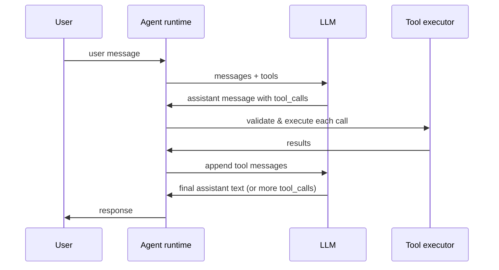

> Part 9 of the Building AI Agents series \{Phần 9\}. Previous \{Trước\}: [Choosing a Model](/blog/choosing-an-llm-model-framework/) · Next \{Tiếp\}: [Agent Patterns: ReAct, Reflection, Planning](/blog/agent-design-patterns-react-reflection-planning/).

An LLM without tools can only rearrange tokens it already saw during training. \{LLM không có tool chỉ có thể sắp xếp lại token đã thấy lúc training.\} **Function calling** (also called **tool use**) is the standard bridge that lets a model *request* actions — query a database, call an API, run code — while your runtime retains full control of execution. \{**Function calling** (hay **tool use**) là cầu nối chuẩn để model *yêu cầu* hành động — query DB, gọi API, chạy code — trong khi runtime của bạn giữ toàn quyền thực thi.\}

This post is the implementation layer between [prompt design](/blog/prompt-engineering-for-agents/) and [agent patterns](/blog/agent-design-patterns-react-reflection-planning/). \{Bài này là tầng implementation giữa [prompt design](/blog/prompt-engineering-for-agents/) và [agent patterns](/blog/agent-design-patterns-react-reflection-planning/).\} You will learn how to define tools, run the loop reliably, handle failures, and avoid turning your agent into an open proxy for arbitrary code. \{Bạn sẽ học cách define tool, chạy loop ổn định, xử lý lỗi, và tránh biến agent thành open proxy cho code tùy ý.\}

> **Mental model \{Mô hình tư duy\}:** Function calling is the model **filling out a request form**, not pressing the button \{Function calling là model **điền vào phiếu yêu cầu**, không phải bấm nút\}. The model writes "I'd like to call `get_weather` with `city=Hanoi`"; your runtime is the clerk who checks the form, decides whether to honor it, runs the action, and hands back the result \{Model viết "tôi muốn gọi `get_weather` với `city=Hanoi`"; runtime của bạn là nhân viên kiểm phiếu, quyết định có làm không, chạy hành động, và trả kết quả\}. **The model never touches your systems directly — it only proposes** \{Model không bao giờ chạm hệ thống của bạn trực tiếp — nó chỉ đề xuất\}.

<iframe
  src="/tools/function-calling-demo/"
  title="Function calling and tool use interactive demo"
  loading="lazy"
  style="width:100%;height:720px;border:1px solid var(--color-border);border-radius:8px;background:#0a0a0a;"
></iframe>

Open the full demo \{Mở demo đầy đủ\}: [/tools/function-calling-demo/](/tools/function-calling-demo/).

---

## Why tools exist: the model proposes, the runtime disposes \{Vì sao cần tool: model đề xuất, runtime quyết định\}

Large language models are **stateless text predictors**. \{LLM là **bộ dự đoán text stateless**.\} They do not have live access to your CRM, weather API, or production database unless you wire it in. \{Chúng không có quyền truy cập trực tiếp CRM, weather API, hay production DB trừ khi bạn nối vào.\} Tool calling formalizes that wiring:

| Without tools | With tools |
|---------------|------------|
| Model hallucinates facts | Model requests verified data |
| No side effects | Controlled side effects via your code |
| Single-turn Q&A | Multi-step agent loops |
| Static knowledge cutoff | Live systems of record |

> **Core contract** \{Hợp đồng cốt lõi\}: The model outputs a **structured tool call** (name + arguments). Your server **validates, executes, and returns results**. The model never runs code directly. \{Model output **tool call có cấu trúc** (tên + argument). Server **validate, execute, trả kết quả**. Model không bao giờ chạy code trực tiếp.\}

Providers (OpenAI, Anthropic, Google, open-weight stacks) expose this via chat APIs with a `tools` parameter and tool-result messages. \{Provider (OpenAI, Anthropic, Google, open-weight stack) expose qua chat API với parameter `tools` và message kết quả tool.\} The mental model is identical across vendors even if field names differ slightly. \{Mental model giống nhau giữa vendor dù tên field hơi khác.\}

---

## Defining tools with JSON Schema \{Define tool bằng JSON Schema\}

Tools are described to the model as **JSON Schema** attached to each function definition. \{Tool được mô tả cho model bằng **JSON Schema** gắn với mỗi function definition.\} The schema tells the model *what* can be called and *what arguments* are valid. \{Schema cho model biết *gì* có thể gọi và *argument* nào hợp lệ.\}

```json
{
  "type": "function",
  "function": {
    "name": "get_weather",
    "description": "Get current weather for a city. Returns temperature and conditions.",
    "parameters": {
      "type": "object",
      "properties": {
        "city": {
          "type": "string",
          "description": "City name, e.g. Hanoi, San Francisco"
        },
        "units": {
          "type": "string",
          "enum": ["celsius", "fahrenheit"],
          "description": "Temperature unit"
        }
      },
      "required": ["city"]
    }
  }
}
```

### Names and descriptions matter more than you think \{Tên và description quan trọng hơn bạn nghĩ\}

The model chooses tools **purely from text** — name, description, and parameter descriptions. \{Model chọn tool **chỉ từ text** — tên, description, và mô tả parameter.\} Vague tools cause wrong calls; overlapping tools cause confusion. \{Tool mơ hồ gây gọi sai; tool trùng chức năng gây nhầm lẫn.\}

| Anti-pattern | Fix |
|--------------|-----|
| `search` | `search_customer_orders` — scope is explicit |
| Description: "Gets data" | "Fetch order by ID from the orders service. Read-only." |
| One mega-tool with 20 params | Split into focused tools with small schemas |
| Parameter `id` with no type | `"type": "string", "pattern": "^ord_[a-z0-9]+$"` |

> **Senior tip** \{Tip senior\}: Write tool descriptions as if onboarding a junior engineer who has never seen your codebase. \{Viết description tool như onboard junior chưa từng thấy codebase.\} Include **when to use**, **when not to use**, and **side effects** (read vs write). \{Gồm **khi nào dùng**, **khi nào không**, và **side effect** (read vs write).\}

Keep the tool catalog **small per request**. \{Giữ catalog tool **nhỏ mỗi request**.\} From [context engineering](/blog/context-engineering-and-agent-memory/), every tool definition consumes tokens in the stable prefix. \{Theo [context engineering](/blog/context-engineering-and-agent-memory/), mỗi tool definition tốn token trong stable prefix.\} Dynamic tool selection — load only relevant tools for the current intent — reduces both cost and misfires. \{Dynamic tool selection — chỉ load tool liên quan intent hiện tại — giảm cost và gọi nhầm.\}

---

## The agent loop: request → tool_call → execute → tool_result → answer \{Vòng agent: request → tool_call → execute → tool_result → answer\}

The canonical loop looks like this:



Step by step \{Từng bước\}:

1. **Build context** — system prompt, history, user message, tool definitions. \{**Build context** — system prompt, history, user message, tool definitions.\}
2. **Model turn** — LLM returns either plain text or `tool_calls` with `name`, `arguments`, and a `tool_call_id`. \{**Model turn** — LLM trả text thuần hoặc `tool_calls` với `name`, `arguments`, và `tool_call_id`.\}
3. **Execute** — your runtime parses arguments, validates schema, runs the handler, captures result or error. \{**Execute** — runtime parse argument, validate schema, chạy handler, capture result hoặc lỗi.\}
4. **Append tool messages** — one message per call, linked by `tool_call_id`. \{**Append tool messages** — một message mỗi call, liên kết bằng `tool_call_id`.\}
5. **Model turn again** — synthesize final answer or emit more tool calls. \{**Model turn lại** — tổng hợp câu trả lời cuối hoặc emit thêm tool call.\}
6. **Repeat** until the model stops calling tools or you hit a step limit. \{**Lặp** đến khi model ngừng gọi tool hoặc chạm step limit.\}

Reference implementation sketch \{Sketch implementation tham chiếu\}:

```python
async def agent_loop(messages: list, tools: list, max_steps: int = 8):
    for step in range(max_steps):
        response = await llm.chat(messages=messages, tools=tools)

        if not response.tool_calls:
            return response.content  # final answer

        # Append assistant message WITH tool_calls intact
        messages.append(response.assistant_message)

        for call in response.tool_calls:
            try:
                args = json.loads(call.arguments)
                validate_args(call.name, args, tools)
                result = await execute_tool(call.name, args)
            except ToolError as e:
                result = {"error": str(e)}

            messages.append({
                "role": "tool",
                "tool_call_id": call.id,
                "content": json.dumps(result),
            })

    raise MaxStepsExceeded("Agent did not finish within step budget")
```

> **Do not strip `tool_calls` from history** \{Đừng strip `tool_calls` khỏi history\}. The model needs the assistant turn that *requested* the tool to interpret subsequent tool results. \{Model cần lượt assistant *đã yêu cầu* tool để hiểu kết quả tool sau đó.\}

Use the demo above to watch the `messages` array grow through each phase. \{Dùng demo trên để xem mảng `messages` tăng qua từng phase.\}

---

## Parallel tool calls \{Gọi tool song song\}

Modern APIs let the model emit **multiple `tool_calls` in one assistant turn**. \{API hiện đại cho model emit **nhiều `tool_calls` trong một lượt assistant**.\} Example: "Weather in Hanoi and what's 23 × 19?" → `get_weather` + `calculator` in parallel. \{Ví dụ: "Thời tiết Hanoi và 23 × 19?" → `get_weather` + `calculator` song song.\}

| Benefit | Caveat |
|---------|--------|
| Lower latency — independent I/O runs concurrently | Results may arrive out of order; link by `tool_call_id` |
| Fewer round-trips to the LLM | Do not assume call order implies dependency |
| Better UX for multi-fact questions | Writes with dependencies must stay sequential |

```json
{
  "role": "assistant",
  "content": null,
  "tool_calls": [
    {
      "id": "call_weather_001",
      "type": "function",
      "function": {
        "name": "get_weather",
        "arguments": "{\"city\":\"Hanoi\"}"
      }
    },
    {
      "id": "call_calc_002",
      "type": "function",
      "function": {
        "name": "calculator",
        "arguments": "{\"expression\":\"23 * 19\"}"
      }
    }
  ]
}
```

Execute independent calls with `asyncio.gather` or a worker pool; append **one tool message per call** before the next model turn. \{Execute call độc lập bằng `asyncio.gather` hoặc worker pool; append **một tool message mỗi call** trước lượt model tiếp theo.\}

> **When to disable parallel** \{Khi nào tắt parallel\}: Sequential workflows (`create_draft` → `send_email`), transactions, or tools where call B depends on output of call A. \{Workflow tuần tự (`create_draft` → `send_email`), transaction, hoặc tool mà call B phụ thuộc output call A.\} Use prompt policy or `parallel_tool_calls: false` where the API supports it. \{Dùng policy prompt hoặc `parallel_tool_calls: false` nếu API hỗ trợ.\}

---

## Forcing and limiting tool choice \{Ép và giới hạn lựa chọn tool\}

Not every turn should allow every tool. \{Không phải lượt nào cũng nên cho phép mọi tool.\}

| Mode | API pattern | Use case |
|------|-------------|----------|
| Auto | `tool_choice: "auto"` | General agent — model decides |
| Required | `tool_choice: "required"` | Must call a tool (structured extraction) |
| Forced function | `tool_choice: {"type":"function","function":{"name":"X"}}` | Pipeline step that always runs X |
| None | `tools: []` or omit tools | Pure chat, no side effects |

**Forced tool** example — always route through a classifier before action tools \{Ví dụ **forced tool** — luôn qua classifier trước action tool\}:

```json
{
  "tool_choice": {
    "type": "function",
    "function": { "name": "classify_intent" }
  }
}
```

Limiting tools reduces **attack surface** and **token cost**. \{Giới hạn tool giảm **attack surface** và **token cost**.\} A billing agent should not see `delete_all_users` in the same request as `get_invoice`. \{Agent billing không nên thấy `delete_all_users` cùng request với `get_invoice`.\}

---

## Argument validation and error handling \{Validate argument và xử lý lỗi\}

Never trust model-generated arguments. \{Không bao giờ tin argument do model sinh.\} Validate **before** execution:

1. **JSON parse** — malformed `arguments` string is common. \{**JSON parse** — string `arguments` lỗi format rất hay gặp.\}
2. **Schema validation** — use JSON Schema, Zod, Pydantic, or Ajv. \{**Schema validation** — dùng JSON Schema, Zod, Pydantic, hoặc Ajv.\}
3. **Business rules** — user can only access their own `order_id`. \{**Business rule** — user chỉ truy cập `order_id` của mình.\}
4. **Sanitization** — reject shell metacharacters, path traversal, SQL fragments in string fields. \{**Sanitization** — reject shell metacharacter, path traversal, SQL fragment trong string field.\}

When validation or execution fails, **return the error to the model** as tool content — do not swallow it. \{Khi validate hoặc execute fail, **trả lỗi cho model** trong tool content — đừng nuốt lỗi.\} Models often self-correct on the next turn. \{Model thường tự sửa ở lượt tiếp theo.\}

```json
{
  "role": "tool",
  "tool_call_id": "call_calc_005",
  "content": "{\"error\":\"Division by zero is undefined\",\"expression\":\"999 / 0\"}"
}
```

| Error type | Return to model | Retry? |
|------------|-----------------|--------|
| Invalid JSON args | Parse error + expected schema | Model fixes args |
| Schema violation | Field-level detail | Model fixes args |
| Transient HTTP 503 | Error + suggest retry | Runtime retries with backoff |
| Auth / permission denied | Clear denial, no retry | Escalate to user |
| Unknown tool name | Should not happen if catalog is consistent | Log bug |

> **Anti-pattern** \{Anti-pattern\}: Catching all errors and returning `"Something went wrong"` — the model cannot recover. \{Catch mọi lỗi và trả `"Something went wrong"` — model không thể recover.\} Be specific and actionable. \{Cụ thể và actionable.\}

---

## Structured outputs vs tool calls \{Structured output vs tool call\}

**Structured output** (JSON mode, `response_format`, grammar constraints) forces the *final* assistant message into a schema. \{**Structured output** (JSON mode, `response_format`, grammar constraint) ép *message assistant cuối* vào schema.\} **Tool calls** let the model *request side effects* mid-reasoning. \{**Tool call** cho model *yêu cầu side effect* giữa reasoning.\} They solve different problems; production agents often use **both**. \{Giải quyết bài toán khác nhau; agent production thường dùng **cả hai**.\}

| | Tool calls | Structured output |
|---|------------|-------------------|
| Purpose | Actions + retrieval | Final typed response |
| Timing | Mid-loop | Usually last turn |
| Side effects | Yes (your executors) | No |
| Example | `search_docs(query)` | `{ "summary": "...", "confidence": 0.92 }` |

Pattern: tools gather facts → structured output formats the user-facing payload. \{Pattern: tool thu thập fact → structured output format payload gửi user.\}

---

## Security: the confused deputy and prompt injection \{Bảo mật: confused deputy và prompt injection\}

Tool use is where agents become **dangerous**. \{Tool use là chỗ agent trở nên **nguy hiểm**.\} The model is an untrusted planner; user and retrieved content can inject instructions. \{Model là planner không tin cậy; user và content retrieve có thể inject instruction.\}

**Never execute untrusted arguments blindly** \{Không bao giờ execute argument không tin cậy một cách mù quáng\}:

- No `eval()`, `exec()`, or shell interpolation on model-supplied strings. \{Không `eval()`, `exec()`, hoặc shell interpolation trên string model cung cấp.\}
- Parameterized queries only — never concatenate SQL. \{Chỉ query parameterized — không nối SQL.\}
- Path allow-lists for file tools — reject `../../etc/passwd`. \{Allow-list path cho file tool — reject `../../etc/passwd`.\}
- Separate **read** and **write** tools; require confirmation or elevated auth for destructive ops. \{Tách tool **read** và **write**; yêu cầu confirm hoặc auth cao hơn cho op phá hoại.\}

The **confused deputy** problem: the agent has credentials; the user tricks it into using them for the attacker's goal. \{Bài toán **confused deputy**: agent có credential; user lừa nó dùng credential cho mục tiêu attacker.\} Mitigations \{Biện pháp\}:

| Layer | Control |
|-------|---------|
| Identity | Bind tool calls to authenticated user; enforce row-level scope |
| Allow-list | Only expose tools needed for this session / role |
| Human-in-the-loop | Confirm transfers, deletes, external sends |
| Output filtering | Block exfiltration patterns in tool args and results |
| Audit | Log every tool call with args, actor, outcome |

Read [AI Safety & Alignment Fundamentals](/blog/ai-safety-alignment-fundamentals/) for the broader threat model. \{Đọc [AI Safety & Alignment Fundamentals](/blog/ai-safety-alignment-fundamentals/) cho threat model rộng hơn.\}

Sandbox execution for code tools: WASM, Firecracker microVMs, or isolated containers with no network egress by default. \{Sandbox cho code tool: WASM, Firecracker microVM, hoặc container cô lập không network egress mặc định.\}

---

## MCP: a standard wire format for tools \{MCP: chuẩn wire format cho tool\}

Defining ad-hoc JSON Schema per project does not scale across teams and clients. \{Define JSON Schema ad-hoc mỗi project không scale giữa team và client.\} The **Model Context Protocol (MCP)** standardizes how hosts discover tools, resources, and prompts from servers. \{**Model Context Protocol (MCP)** chuẩn hóa cách host discover tool, resource, và prompt từ server.\}

Conceptual mapping \{Mapping khái niệm\}:

| Your agent | MCP |
|------------|-----|
| Tool registry | MCP server `tools/list` |
| Tool executor | MCP server `tools/call` |
| RAG documents | MCP `resources` |
| Reusable prompt templates | MCP `prompts` |

MCP does not replace your validation or auth — it replaces **N custom integrations** with one protocol. \{MCP không thay validation hay auth — nó thay **N integration tùy biến** bằng một protocol.\} See [MCP Architecture Deep Dive](/blog/mcp-model-context-protocol-architecture/) for transport, capability negotiation, and deployment patterns. \{Xem [MCP Architecture Deep Dive](/blog/mcp-model-context-protocol-architecture/) cho transport, capability negotiation, và deployment pattern.\}

---

## Idempotency, retries, and exactly-once illusions \{Idempotency, retry, và ảo tưởng exactly-once\}

Agents retry. Networks flap. Models re-emit the same tool call after a timeout. \{Agent retry. Network flap. Model re-emit cùng tool call sau timeout.\} Design tools accordingly. \{Thiết kế tool cho phù hợp.\}

| Tool type | Strategy |
|-----------|----------|
| Read-only (`get_weather`, `search`) | Safe to retry freely |
| Create (`create_ticket`) | Idempotency key in args; dedupe server-side |
| Update / delete | Version checks, conditional writes |
| Payment / send | Never auto-retry; require explicit user confirm |

```js
async function executeWithRetry(name, args, { maxAttempts = 3 } = {}) {
  const idempotencyKey = args.idempotency_key ?? crypto.randomUUID();

  for (let attempt = 1; attempt <= maxAttempts; attempt++) {
    try {
      return await dispatchTool(name, { ...args, idempotency_key: idempotencyKey });
    } catch (err) {
      if (!err.retryable || attempt === maxAttempts) throw err;
      await sleep(exponentialBackoff(attempt));
    }
  }
}
```

Track **`tool_call_id` → result** in a short-lived cache so duplicate deliveries within one session return the same payload without double side effects. \{Track **`tool_call_id` → result** trong cache ngắn hạn để delivery trùng trong một session trả cùng payload mà không double side effect.\}

Set a **max loop steps** (typically 5–15) and a **wall-clock timeout** per agent run. \{Đặt **max loop step** (thường 5–15) và **wall-clock timeout** mỗi lần chạy agent.\} From [Stopping Criteria](/blog/llm-stopping-criteria-and-output-control/), pair this with token budgets. \{Theo [Stopping Criteria](/blog/llm-stopping-criteria-and-output-control/), kết hợp với token budget.\}

---

## Production checklist \{Checklist production\}

Before shipping tool use to users \{Trước khi ship tool use cho user\}:

- [ ] Tool names and descriptions reviewed for clarity and non-overlap
- [ ] JSON Schema validation on every call; business-rule checks after schema
- [ ] Errors returned to model with actionable detail
- [ ] Read/write separation; destructive ops gated
- [ ] Parallel execution only for independent tools
- [ ] Idempotency keys on mutating tools
- [ ] Max steps + timeout on the agent loop
- [ ] Full audit log of tool name, args, actor, latency, outcome
- [ ] Tool catalog scoped per role / session (not global dump)
- [ ] Eval cases for wrong-tool, bad-args, and injection attempts

---

## Key takeaways \{Điểm chính\}

1. **Tools are the agent's hands** — the model proposes; your runtime validates and executes \{**Tool là tay của agent** — model đề xuất; runtime validate và execute\}.
2. **JSON Schema quality drives call accuracy** — invest in names, descriptions, and small focused tools \{**Chất lượng JSON Schema quyết định độ chính xác call** — đầu tư tên, description, và tool nhỏ tập trung\}.
3. **The loop is predictable** — tool_call → execute → tool message → next turn; preserve `tool_calls` in history \{**Loop dự đoán được** — tool_call → execute → tool message → lượt tiếp; giữ `tool_calls` trong history\}.
4. **Parallel calls save latency** but require per-call IDs and careful dependency analysis \{**Parallel call tiết kiệm latency** nhưng cần ID mỗi call và phân tích dependency cẩn thận\}.
5. **Return errors to the model** — specificity enables self-correction \{**Trả lỗi cho model** — chi tiết giúp tự sửa\}.
6. **Security is non-negotiable** — allow-lists, sandboxing, auth scope, human confirm for high-impact ops \{**Bảo mật không thương lượng** — allow-list, sandbox, auth scope, confirm người cho op impact cao\}.
7. **MCP standardizes discovery and invocation** across tools and hosts \{**MCP chuẩn hóa discover và invoke** giữa tool và host\}.
8. **Design for retries** — idempotency keys and dedupe caches prevent duplicate side effects \{**Thiết kế cho retry** — idempotency key và cache dedupe tránh side effect trùng\}.

## Common Mistakes \{Lỗi thường gặp\}

- **Executing model-supplied strings blindly \{Execute string model cung cấp một cách mù quáng\}** — `eval()`, shell interpolation, or string-concatenated SQL is a remote-code-execution waiting to happen \{`eval()`, shell interpolation, hoặc SQL nối chuỗi là lỗ hổng RCE chờ sẵn\}.
- **Stripping `tool_calls` from history \{Strip `tool_calls` khỏi history\}** — the model loses the turn that requested the tool and can't interpret the result \{model mất lượt đã yêu cầu tool và không hiểu kết quả\}.
- **Swallowing errors as `"Something went wrong"` \{Nuốt lỗi thành `"Something went wrong"`\}** — return specific, actionable errors so the model self-corrects \{trả lỗi cụ thể, actionable để model tự sửa\}.
- **Dumping the whole tool catalog every request \{Dump cả catalog tool mỗi request\}** — wastes tokens and widens attack surface; scope tools per role/intent \{tốn token và mở rộng attack surface; scope tool theo role/intent\}.
- **Parallel-calling dependent tools \{Gọi song song tool phụ thuộc\}** — `create_draft` then `send_email` must stay sequential \{`create_draft` rồi `send_email` phải tuần tự\}.
- **Auto-retrying mutating tools \{Auto-retry tool mutating\}** — no idempotency key means duplicate charges, double sends \{thiếu idempotency key nghĩa là tính tiền trùng, gửi đôi\}.
- **No `max_steps` / timeout \{Không có `max_steps` / timeout\}** — one confused loop burns your budget \{một vòng lặp rối đốt sạch budget\}.

## When Should You Use This? \{Khi nào nên dùng\}

| Need | Use tools? |
| --- | --- |
| Live/private data, actions, side effects | **Yes** — function calling is the bridge |
| Only a typed final answer, no actions | **No** — use structured output (`response_format`) |
| Both: gather facts, then format output | **Both** — tools mid-loop, structured output last |
| Pure chat, no external systems | **No** — omit `tools` entirely |

**Risk scales with power \{Rủi ro tỉ lệ với quyền lực\}**: read-only tools (`search`, `get_*`) are low-risk and safe to retry; mutating or destructive tools (`delete`, `transfer`, `send`) demand auth scope, idempotency, and human confirmation \{tool read-only rủi ro thấp, retry an toàn; tool mutating/phá huỷ cần auth scope, idempotency, và xác nhận của người\}.

Next in the series: **Agent Patterns** — ReAct, reflection, and planning loops that orchestrate multiple tool turns into reliable workflows. \{Tiếp theo: **Agent Patterns** — ReAct, reflection, và planning loop điều phối nhiều lượt tool thành workflow ổn định.\}

---

## The Building AI Agents series \{Loạt bài Building AI Agents\}

1. [Tokens & Context Windows](/blog/ai-agents-tokens-and-context-windows/)
2. [Sampling: temperature, top_p, top_k](/blog/llm-sampling-temperature-top-p-top-k/)
3. [Prompt Engineering for Agents](/blog/prompt-engineering-for-agents/)
4. [Stopping Criteria & Output Control](/blog/llm-stopping-criteria-and-output-control/)
5. [Context Engineering & Memory](/blog/context-engineering-and-agent-memory/)
6. [Fine-tuning vs Prompting vs RAG](/blog/fine-tuning-vs-prompting-vs-rag/)
7. [Evaluating LLMs & Agents](/blog/evaluating-llms-and-agents/)
8. [Choosing a Model](/blog/choosing-an-llm-model-framework/)
9. **[Function Calling & Tool Use](/blog/function-calling-and-tool-use/)**
10. [Agent Patterns: ReAct, Reflection, Planning](/blog/agent-design-patterns-react-reflection-planning/)
